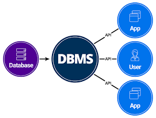

# Learn What is Database | Types of Database | DBMS

## What is Data?
+ Data can be anything and everything. Any information or fact can be considered as Data. For example, name, age, date of birth, house address or any other information.

+ Data can be in any form such as an image or a video or a file or even a plain text. Data in any of this format can be stored into a database.

## What is Database?
+ Database can be considered as a container filled with data or information which is electronically stored in a computer system. Data in any form can be stored into the database.

### Purpose of storing the data into the database
- Easily Accessed
- Modified
- Protected
- Analysed

## DBMS
+ DBMS, aka Database management system, is a software which is used to manage your database. You need DBMS to interact with database to store, modify, retrieve and protect data.
+ DBMS is also required to creat, modify and delete database. Users like you and me can use DBMS to enter commands in a specific language to interact with Database.
+ Examples of DBMS:
  - MySQL
  - PostgreSQL
  - MangoDB
  - Neo4j
  - Cassandra
  - SQLite

## Evolution of Database
1. Flat File Database
2. Hierarchical Database
3. Network Database
4. Relational Database(over 74%; Oracle) & Non-Relational Database(MongoDB, very popular in social media because of immense rising data usage)
> The biggest companies today who store data related to millions of users everyday, generally use combination of both relational and non-relational database

## Relational Database
+ In Relational Database, data is stored through collection of tables, these tables are related to one and one. Each table consists of columns and rows, each column has a name and a data type, only data that satisfy this data type can be inserted in the specific column. A row can be treated as a record which is formed by single or multiple columns.

+ In the relational database using DBMS you can enter commands in specific language to store retrieve and modify data. This specific language is SQL or Structured Query Language. SQL is a programming language which follows a standard format for quering data across different relational database.

Examples of relational database:
1. Oracle
2. Microsoft SQL Server
3. MySQL
4. PostgreSQL
5. SQLite
  > (advantages of SQLite: In SQLite, a database is stored in a single file — a trait that distinguishes it from other database engines. This fact allows for a great deal of accessibility: copying a database is no more complicated than copying the file that stores the data, sharing a database can mean sending an email attachment.
  Backdraws: It's a poor choice when many different users are updating the table at the same time (to maintain integrity of data, only one user can write to the file at a time). It also may require some more work to ensure the security of private data due to the same features that make SQLite accessible. Furthermore, SQLite does not offer the same exact functionality as many other database systems, limiting some advanced features other relational database systems offer. Lastly, SQLite does not validate data types. Where many other database software would reject data that does not conform to a table’s schema, SQLite allows users to store data of any type into any column.)

## Non-Relational Database
1. Key Value Database
2. Document Database
3. Graph Database
4. Wide Column Database
5. Search Engine Database
6. Time Series Database

These Database store data differently and are useful for managing specific types of data.

### Key Value Database(Key Value Store)
It is the simplist non-relational database and as the name suggested, every data stored in this database will be assigned to a key to store data.

Key value database are very useful to store certain types of data, such as configuration data, state information or any data that might be represented  by a dictionary or a hash in a programming language.

Examples of Key Value Database:
1. Redis Database
2. Memcached Database

### Document Database(Document Store)
These also use unique key to identify data stored in database, however unlike key value store, document database store data in structured format called documents, ofen using json or xml format.

Though each document within this database has structured data, there is no specific format to be follwed for all documents. Each document can have its own structure which the database understans. Unlike the key value store, the data stored in document database can be queried and analyzed

Examples of Key Value Database:
1. MongoDB
2. CouchDB
