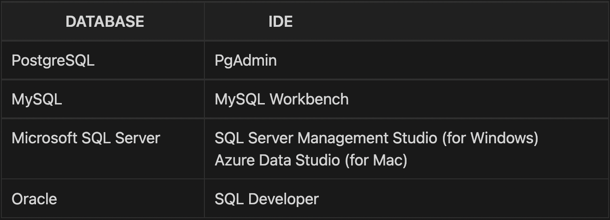

# **How to learn SQL for free | Roadmap to learning SQL**

In this video, a complete roadmap on how to learn SQL for Beginners, Intermediate level, Advanced level and for database developers will be found.

You will know how to choose a database and what SQL concepts you need to learn to have basic, intermediate, advanced and developer level knowledge of SQL.

[Watch the video here](https://youtu.be/a-hFbr-4VQQ)

# **Pre-Requisites**

## Choose your relational database (RDBMS)
- Most popular RDBMS are:

  + Oracle
  + MySQL
  + Microsoft SQL Server
  + PostgreSQL

- Checkout [DB-Engines](https://db-engines.com/en/) to get list of popular databases

## Install the database

- If using cloud based database/datawarehouse then make sure to setup on your system.

## Install the IDE
Mentioned here are the IDE for 4 most popular RDBMS:

# **Basic SQL**

## Concepts

#### What is a Relational Database / RDBMS?
+ How data is stored in a relational database?
+ What is a schema wrt to a relational database?

#### SQL commands
+ DDL, DML, DCL, TCL, DQL
+ What are commands under each of these category and what each of these commands actually do?

#### Data Types
+ String data type like VARCHAR, TEXT etc
+ Integer data type like INT, NUMBER etc.
+ DATE
+ FLOAT / DECIMAL
+ BOOLEAN
+ Also check out IDENTITY column (Auto Increment column)

#### Constraints
+ Primary key
+ Foreign key
+ Check constraint, Not null constraint, Unique constraint, Default etc.

#### Normalization in SQL
+ Different normal forms like 1NF, 2NF, 3NF, BCNF

### Operators
+ Arithmetic operator
+ Logical operator
+ Comparison operator
+ UNION, UNION ALL operator

#### CASE statement
+ Simple case statement as well nested case statement.

#### Important SQL clause
+ DISTINCT clause
+ Order by clause
+ Limit / Top clause

#### INNER join
+ How to fetch data from multiple tables.

## Learning Resources
+ [Install PostgreSQL database and PgAdmin tool](https://youtu.be/1aybOgni7lI)
+ [Database tutorial](https://youtu.be/j09EQ-xlh88)
+ [Complete Basic SQL tutorial](https://youtu.be/Hl4NZB1XR9c)
+ [W3Schools](https://www.w3schools.com/sql/)
## Practice Platforms
+ [StrataScratch (Easy SQL problems)](https://www.stratascratch.com/?via=techTFQ)
+ [LeetCode (Easy SQL problems)](https://leetcode.com/)
+ [DataLemur (Easy problems)](https://datalemur.com/)
## Jobs
+ Business Analyst
+ Junior Analyst roles
+ Software Engineer

# **Intermediate SQL**

## Concepts

#### Group By and Having clause
#### Aggregate functions
#### Order of Execution
#### Sub-Queries
#### CTE table / WITH clause
#### All type of Joins
+ LEFT Join, RIGHT Join, FULL OUTER Join
+ CROSS Join, SELF Join

#### In-built functions
+ String functions like Substring, Position, Coalesce etc.
+ Date functions like Extract, To_Date etc.

#### Window functions
+ Most important are RANK, DENSE_RANK, ROW_NUMBER, LEAD, LAG
+ Also good to learn FIRST_VALUE, LAST_VALUE, NTH_VALUE, NTILE

#### Views

## Learning Resources
+ [Group By, Having clause](https://www.w3schools.com/sql/)
+ [Order of Execution](https://towardsdatascience.com/a-look-into-sqls-order-of-execution-d0b81e361c66)
+ [Sub-Queries Tutorial](https://youtu.be/nJIEIzF7tDw)
+ [CTE / WITH clause Tutorial](https://youtu.be/QNfnuK-1YYY)
+ JOINS Tutorial
  - [Part 1](https://youtu.be/0OQJDd3QqQM)
  - [Part 2](https://youtu.be/RehbnzKHS28)
+ Window functions Tutorial
  - [Part 1](https://youtu.be/Ww71knvhQ-s)
  - [Part 2](https://youtu.be/zAmJPdZu8Rg)
+ [Views Tutorial](https://youtu.be/cLSxasHg9WY)
+ In-built functions
  - [PostgreSQL LEFT: Get First N Characters in a String](https://www.postgresqltutorial.com/postgresql-string-functions/postgresql-left/)
  - [Oracle String Functions By Examples](https://www.oracletutorial.com/oracle-string-functions/)
  - [SQL Server String Functions](https://www.sqlservertutorial.net/sql-server-string-functions/)
  - [MySQL String Functions Overview](https://www.mysqltutorial.org/mysql-string-functions/)
+ Date functions:
  - [PostgreSQL AGE Function](https://www.postgresqltutorial.com/postgresql-date-functions/postgresql-age/)

  - [Oracle Date Functions](https://www.oracletutorial.com/oracle-date-functions/)

  - [SQL Server Date Functions Overview](https://www.sqlservertutorial.net/sql-server-date-functions/)

  - [MySQL Date Functions: Handling Date & Time Data More Effectively](https://www.sqlservertutorial.net/sql-server-date-functions/)

## Practice Platforms
+ [StrataScratch (Medium level problems)](https://www.stratascratch.com/?via=techTFQ)
+ [LeetCode (Medium level problems)](https://leetcode.com/)
+ [DataLemur (Medium level problems)](https://datalemur.com/)
+ [SQL case study from Data with Danny](https://8weeksqlchallenge.com/)
## Jobs
+ Data Analyst
+ Data Scientist

# **Advance SQL**

## Concepts

#### Recursive SQL Queries
#### PIVOT table / CROSSTAB function
#### Materialized Views
#### Stored Procedure
#### User Defined Functions

## Learning Resources
+ [Recursive SQL Queries](https://youtu.be/7hZYh9qXxe4)
+ [PIVOT table / CROSSTAB function](https://youtu.be/4p-G7fGhqRk)
+ [Materialized Views](https://youtu.be/WzkBZ0byoYE)
+ [Stored Procedure](https://youtu.be/yLR1w4tZ36I)
+ JOINS Tutorial
  - [Part 1](https://youtu.be/0OQJDd3QqQM)
  - [Part 2](https://youtu.be/RehbnzKHS28)
+ Window functions Tutorial
  - [Part 1](https://youtu.be/Ww71knvhQ-s)
  - [Part 2](https://youtu.be/zAmJPdZu8Rg)
+ [Views Tutorial](https://youtu.be/cLSxasHg9WY)
+ [User Defined Functions](https://www.sqlshack.com/learn-sql-user-defined-functions/)

## Practice Platforms
+ [StrataScratch (Hard level problems)](https://www.stratascratch.com/?via=techTFQ)
+ [LeetCode (Hard level problems)](https://leetcode.com/)
+ [DataLemur (Hard level problems)](https://datalemur.com/)
+ [SQL case study from Data with Danny](https://8weeksqlchallenge.com/)
## Jobs
+ Data Engineer
+ ETL Developers

# **SQL for Database Developers / SQL Developers**

## Concepts

#### Indexes
#### Triggers
#### Temporary tables
#### Dynamic Execution of SQL statements
#### PL/SQL concepts
  - Variables
  - Cursors
  - Collection types
  - Loop statements
  - IF Else statement
  - Exception Handling
  - Packages
#### Performance tuning
  - Explain plan
  - Table Statistics
  - Table Partitioning
  - DBMS_Profiler
  - SQL Trace and TKProf

## Learning Resources
+ [Indexes](https://www.sqlshack.com/sql-index-overview-and-strategy/)
+ [Triggers](https://www.sqlshack.com/learn-sql-sql-triggers/)
+ [Temporary tables](https://codingsight.com/introduction-to-temporary-tables-in-sql-server/)
+ [Dynamic Execution of SQL statements](https://www.sqlshack.com/dynamic-sql-in-sql-server/)
+ [PL/SQL concepts](https://www.oracletutorial.com/plsql-tutorial/)

## Practice Platforms
+ Explain Plan:
  + [Understanding Oracle Explain Plan](http://www.dba-oracle.com/t_understanding_oracle_explain_plan.htm)
  + [EXPLAIN PLAN FOR and DBMS_XPLAN.DISPLAY](https://use-the-index-luke.com/sql/explain-plan/oracle/getting-an-execution-plan)

+ Table Statistics:
  + [Oracle Tables and Statistics](http://www.dba-oracle.com/concepts/tables_optimizer_statistics.htm)

+ Table Partitioning:
  + [5.11. Table Partitioning](https://www.postgresql.org/docs/current/ddl-partitioning.html)

+ DBMS_Profiler:
  + [DBMS_PROFILER](https://oracle-base.com/articles/9i/dbms_profiler)

+ SQL Trace and TKProf:
  + [SQL trace, 10046, trcsess and tkprof in Oracle](https://oracle-base.com/articles/misc/sql-trace-10046-trcsess-and-tkprof)

## Jobs
+ Database Developers
+ SQL Developers
